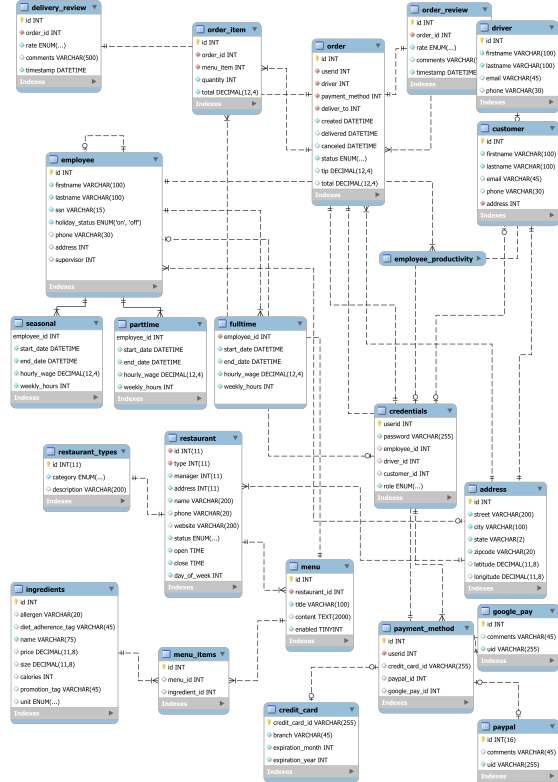
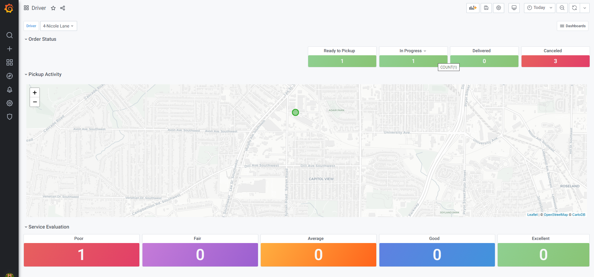
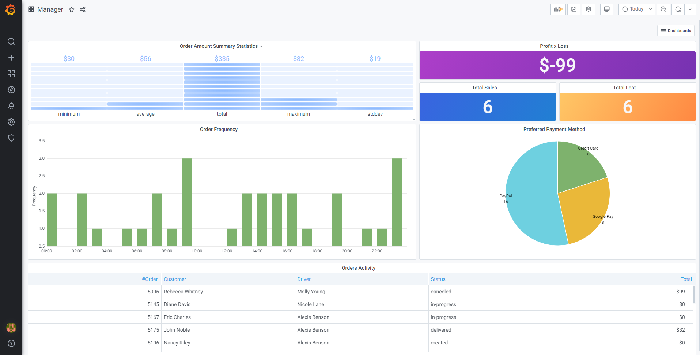

## **CSC-4710 - Database Systems** 
### Georgia States University 
### Fall 2020
____
#### **Group Information**
```
  ___   _   _______             
 / _ \ | | / /_   _|            
/ /_\ \| |/ /  | |              
|  _  ||    \  | |              
| | | || |\  \_| |_             
\_| |_/\_| \_/\___/             
                                
                                
      _____ _____  ___  ___  ___
     |_   _|  ___|/ _ \ |  \/  |
       | | | |__ / /_\ \| .  . |
       | | |  __||  _  || |\/| |
       | | | |___| | | || |  | |
       \_/ \____/\_| |_/\_|  |_/


    A K I
    | | |
    | | |
    | | +---------- Iffatun Nessa Mahi (imahi1@student.gsu.edu)
    | +------------ Kirby Liu (kirby.liu@Student.gsu.edu) 
    +-------------- Alexandre Geraldo (ageraldo1@student.gsu.edu)                                                                
```
____
#### **Project Information**
___

+ **Topic:** Online Food Ordering Platform for Small Restaurants. 


+ **Inspiration:** 
The year 2020 has been a remarkable year that has brought about many changes to the restaurant industry. Through the lockdown, many restaurants have had to become dependent on food delivery service to survive while indoor dining has either been forced to close or become a much less popular dining option. 
Before the pandemic, food delivery might have compromised 10%-15% of revenue however as Covid-19 hotspots are popping up throughout the country, many restaurants are reporting 90% plus delivery-based sales. Several business owners have had to reinvent their businesses to survive the changes caused by COVID-19. Small restaurant owners are particularly hit hard and are still struggling to survive in this environment. To keep businesses open, many small restaurants are forced to move to an online ordering platform such as UberEats or GrubHub. These online platforms provide all the tools necessary to put a local restaurant into the online ordering food business. That sounds fantastic but there is an issue here: These platforms charge the restaurant a fee for each transaction. These fees are incredibly unpopular, but many restaurant owners feel they have no other options as a Washington Post article, “Restaurants are barely surviving. Delivery apps will kill them ,” recently highlighted the high delivery fees of popular delivery apps like Grubhub, DoorDash, and Uber eats charges both restaurant owners for each transaction. Many restaurant owners voiced concerns as these fees barely allow restaurant owners to survive an already difficult conditions brought about by the pandemic. 
Our aim for this project is to provide an alternative/sustainable platform for restaurants to participate in the food delivery/gig worker economy that benefits restaurant owners, drivers, and customers.  For customers the application will offer feature-rich functionalities that tracks previous order preferences, recommends new restaurants/menu, offer promotions, and provide reviews of nearby restaurants. For restaurants the application will offer simple commonly used features that include employee management, menu management, app sales notification, and promotion offerings. Our goal is to keep fees low, so that the money collected will be majority for the gig-workers that deliver the food.
Our metric for success is to -1) create a working prototype that 2) once presented to restaurant owners, potential customers, and from gig-workers receives positive feedback, and 3) lastly the payment model is sustainable from an operational/business standpoint for all stakeholders including application developers, restaurant owners, gig-workers, and customers alike. 

_____
**Required Analysis**
_____
+ **User Requirements**
    + The system will allow customers to add orders, verify orders status, cancel orders.
    + The system will allow drivers to pick orders from a queue and delivering to customers.
    + The system will allow customers to create favorite orders.
    + The system will provide a global address catalog to avoid duplicate records added to the system. The address catalog will also provide latitude and longitude coordinates to be used in data visualizations.
    + The system will allow the restaurants to specify the operation hours of the business, select a local manager, and implement the use of the global address catalog. A restaurant must also have a feature to enable or disable the ordering system as a whole.
    + The system will track total sales for reporting and tax purposes for restaurants.
    + The system will allow customers to evaluate orders and deliveries.
    + This system will allow to store customer information such as name, deliver address, contact information.
    + This system will allow to store employee information such as their name, address, working hours, productivity.
    + This system is for promoting limited-time-only discounts for customers.
    + This system will identify potential customers to give them discounts based on their bill amount.
    + The system will allow restaurants will be able to build their menu offering while listing calories, prices, size, promotions, and food category of their food and drink offering.
    + The system will allow restaurants will have the ability to list the ingredients of each food and tag with special dietary and/or common food allergens.
    + The system will allow customers to be able to save preferred payment options of credit/debit cards (with billing address), paypal, and/or google pay.
    + The system will allow drivers to input and store their vehicle, driver’s license, driver history, insurance, bank, and tax information upon enrollment.
    + The system will allow customers/restaurants/drivers to input and store their contact information including email, phone number, and mailing address.
    + The system will allow customers/restaurants/drivers to view their past orders and transaction receipts.
_____
**Architecture Design**
_____
+ **Backend**
    + **Database**
        + MYSQL 8.0.22

    + **Test Data Generator** 
        + Python 3.8

    + **Container**
        + Docker 19.03.13

+ **Frontend**
    + Visualization
        + Grafana v7.3.4
        
_____
**Entity Relation Diagram**
_____


_____
**Physical Diagram**
_____



_____
**Environment Build Process**
_____
1. **Download and install Docker & MySQL Workbench**
    + **Docker:** https://www.docker.com/products/docker-desktop
    + **MySQL Workbench:** https://www.mysql.com/products/workbench/


2. **Pull the following images from DockerHub.**
    +  MySQL 
        ```bash
        docker pull mysql:8.0.22        
        ```
    + Grafana
        ```bash
        docker pull grafana/grafana:7.3.4
        ```

3. **Create a dedicated docker network for the containers.**
    ```bash
    docker network create gsu
    ```

4. **Construct the custom images for each container.**
    + MySQL
        ```bash
        docker build -t mysql-csc-4710-template -f docker/mysql/Dockerfile SQL/
        ```

        ```text
        Sending build context to Docker daemon   7.31MB
        Step 1/7 : FROM mysql:8.0.22
        8.0.22: Pulling from library/mysql
        852e50cd189d: Pull complete
        29969ddb0ffb: Pull complete
        a43f41a44c48: Pull complete
        5cdd802543a3: Pull complete
        b79b040de953: Pull complete
        938c64119969: Pull complete
        7689ec51a0d9: Pull complete
        a880ba7c411f: Pull complete
        984f656ec6ca: Pull complete
        9f497bce458a: Pull complete
        b9940f97694b: Pull complete
        2f069358dc96: Pull complete
        Digest: sha256:4bb2e81a40e9d0d59bd8e3dc2ba5e1f2197696f6de39a91e90798dd27299b093
        Status: Downloaded newer image for mysql:8.0.22
        ---> dd7265748b5d
        Step 2/7 : ARG MYSQL_DATABASE=CSC4710
        ---> Running in 878a006e0951
        Removing intermediate container 878a006e0951
        ---> 1f92e5091c6b
        Step 3/7 : ARG MYSQL_USER=csc4710
        ---> Running in e8cffd0bb2d2
        Removing intermediate container e8cffd0bb2d2
        ---> a96d4473bd74
        Step 4/7 : ARG MYSQL_PASSWORD=password
        ---> Running in 848c7e703347
        Removing intermediate container 848c7e703347
        ---> 695d77603bbf
        Step 5/7 : ENV MYSQL_DATABASE=${MYSQL_DATABASE}
        ---> Running in 68f5880feb45
        Removing intermediate container 68f5880feb45
        ---> 157fd62f7e27
        Step 6/7 : ENV MYSQL_USER=${MYSQL_USER}
        ---> Running in b70c8962b469
        Removing intermediate container b70c8962b469
        ---> da86a22281a0
        Step 7/7 : ENV MYSQL_PASSWORD=${MYSQL_PASSWORD}
        ---> Running in a5f2de2ee262
        Removing intermediate container a5f2de2ee262
        ---> 6f450553082a
        Successfully built 6f450553082a
        Successfully tagged mysql-csc-4710-template:latest
        ```
    + Grafana
        ```bash 
        docker build -f docker/grafana/Dockerfile -t app-grafana-loader docker/grafana
        ```
5. **Start the containers**
    + MYSQL
        ```bash
        docker run --name mysql-csc-4710 --network gsu -p 3306:3306 -d mysql-csc-4710-template 
        ```
        **Note:** this process can take several minutes to complete. Check the container logs for the following message:
        ```bash
        docker container logs mysql-csc-4710
        ```

        ```text
        2020-11-24 23:08:05+00:00 [Note] [Entrypoint]: MySQL init process done. Ready for start up.

        2020-11-24T23:08:05.761154Z 0 [System] [MY-010116] [Server] /usr/sbin/mysqld (mysqld 8.0.22) starting as process 1
        2020-11-24T23:08:05.771092Z 1 [System] [MY-013576] [InnoDB] InnoDB initialization has started.
        2020-11-24T23:08:06.973433Z 1 [System] [MY-013577] [InnoDB] InnoDB initialization has ended.
        2020-11-24T23:08:07.315138Z 0 [System] [MY-011323] [Server] X Plugin ready for connections. Bind-address: '::' port: 33060, socket: /var/run/mysqld/mysqlx.sock
        2020-11-24T23:08:08.206152Z 0 [Warning] [MY-010068] [Server] CA certificate ca.pem is self signed.
        2020-11-24T23:08:08.206504Z 0 [System] [MY-013602] [Server] Channel mysql_main configured to support TLS. Encrypted connections are now supported for this channel.
        2020-11-24T23:08:08.388181Z 0 [Warning] [MY-011810] [Server] Insecure configuration for --pid-file: Location '/var/run/mysqld' in the path is accessible to all OS users. Consider choosing a different directory.
        2020-11-24T23:08:08.417446Z 0 [System] [MY-010931] [Server] /usr/sbin/mysqld: ready for connections. Version: '8.0.22'  socket: '/var/run/mysqld/mysqld.sock'  port: 3306  MySQL Community Server - GPL.
        ```
        **This message indicated the instance is up and running.**
    + Grafana
        + Console
            ```bash
            docker run -d -p 3000:3000 --name grafana-csc-4710 --network gsu -e "GF_INSTALL_PLUGINS=grafana-piechart-panel,grafana-worldmap-panel" grafana/grafana:7.3.4
            ```
        + Customization
            ```bash
            docker run --rm --network gsu app-grafana-loader
            ```

6. **Perform a records count check**
    ```bash
    # only execute this step when the container is fully operational.

    docker exec -it mysql-csc-4710 mysql -u csc4710 -ppassword -e "SELECT table_name, SUM(table_rows) FROM INFORMATION_SCHEMA.TABLES WHERE TABLE_SCHEMA = 'CSC4710' GROUP BY table_name ORDER BY TABLE_NAME;"
    ```

    | TABLE_NAME            | SUM(table_rows) |
    |-----------------------|-----------------|
    | address               |             100 |
    | credentials           |             140 |
    | credit_card           |              45 |
    | customer              |             100 |
    | delivery_review       |             513 |
    | driver                |               5 |
    | employee              |              35 |
    | employee_productivity |               0 |
    | fulltime              |               5 |
    | google_pay            |              37 |
    | ingredients           |               7 |
    | menu                  |               3 |
    | menu_items            |               6 |
    | order                 |            1000 |
    | order_item            |            1000 |
    | order_review          |             507 |
    | parttime              |               3 |
    | payment_method        |             140 |
    | paypal                |              59 |
    | restaurant            |               1 |
    | restaurant_types      |               6 |
    | seasonal              |               5 |

7. **Connect to MYSQL Workbench**
    + **Hostname:** 127.0.0.1
    + **Port:** 3306
    + **Username:** csc4710
    + **Password:** password
    + **Database:** CSC4710

8. **Additional Information**
    + Stop Container
        ```bash 
        docker container stop mysql-csc-4710
        ```

    + Remove Container
        ```bash
        docker container rm mysql-csc-4710
        ```

9. **Accessing Grafana**
    + **URL:** http://localhost:3000
    + **Username:** admin
    + **Password:** admin

    + **Dashboards:**
        + Driver
            
        
        + Manager
            
_____
**Data Load Generators**
_____
+ **Address** 
    + [01-LoadAddressTable.ipynb](notebooks/01-LoadAddressTable.ipynb)
        
+ **Employee, Seasonal, Parttime, Fulltime** 
    + [02-LoadEmployee.ipynb](notebooks/02-LoadEmployee.ipynb)
    
+ **Restaurant, Restaurant_Types** 
    + [03-LoadRestaurant.ipynb](notebooks/03-LoadRestaurant.ipynb)

+ **Customer** 
    + [04-LoadCustomer.ipynb](notebooks/04-LoadCustomer.ipynb)

+ **Driver** 
    + [05-LoadDriver.ipynb](notebooks/05-LoadDriver.ipynb)

+ **Credentials** 
    + [06-LoadCredentials.ipynb](notebooks/06-LoadCredentials.ipynb)

+ **Menu, Menu_Item, Ingredients** 
    + [07-LoadMenu.ipynb](notebooks/07-LoadMenu.ipynb)

+ **Payment Method** 
    + [08-LoadPaymentMethod.ipynb](notebooks/08-LoadPaymentMethod.ipynb)

+ **Orders and Reviews** 
    + [09-LoadOrders.ipynb](notebooks/09-LoadOrders.ipynb)
_____
**Links**
_____
+ **Entity-Relationshop Model:** 
    + https://drive.google.com/file/d/1a8tK_D-bycxRgjdm3OVcIxb5bUXvbMX_/view?usp=sharing

+ **Relational Model**
    + https://drive.google.com/file/d/12m3OyRWFgVFjw6_BgBYfnHkOkYJ6sllo/view?usp=sharing
